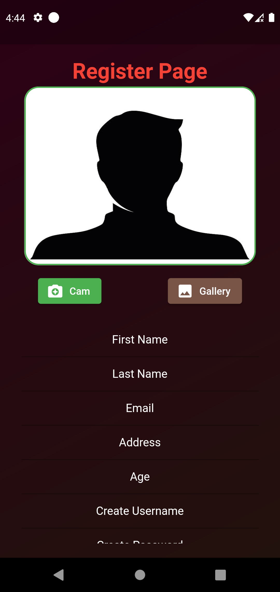
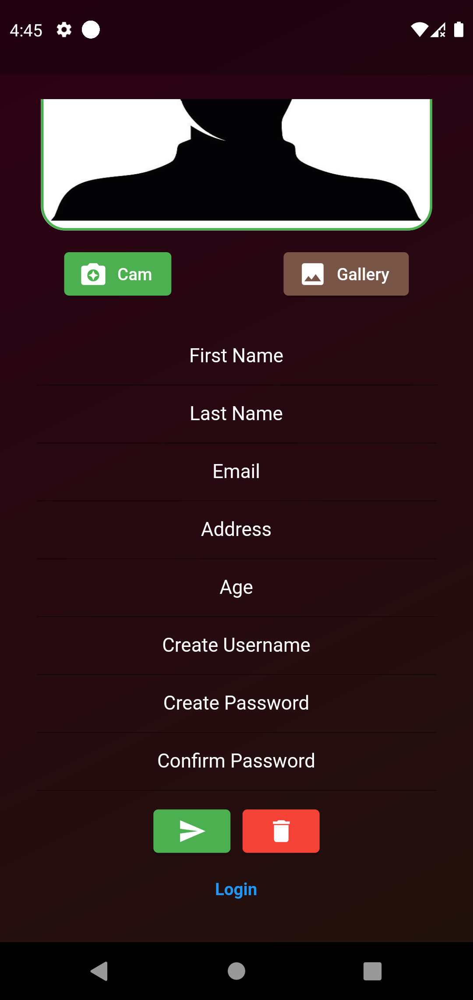

# Freelance Nepal

Freelance Nepal is a digital platform for Nepalese freelancers to sell their skills and services to different clients. On the other hand, the target clients of Freelance Nepal can use this platform to buy the necessary services and hire different freelancers for their gigs. This application works with concept of freelancers posting their gigs based on their skill set and the clients hiring them for the gigs. 

## Features
Some key features of Freelance Nepal application are :
1. User Registration
The Users can register their accounts into the database of the application.

2. User Login 
The registered users can login into the application with a valid username and password.

3. Post Gigs
The logged in users can post gigs along with images to sell their skills.

4. Hire Freelancers
The logged in users can hire freelancers by purchasing their respective gigs.

5. Receive System Notifications:
The users of Freelance Nepal can receive notifications sent by system admin.

6. Check Profile Calculations
The User's profile page shows all the information about the hiring, the works completed, as well as the total earnings as well as total investments of the users.

7. Update Gigs
In case the users want to change the entire looks or information of their gigs, they can update their gigs.

8. Update Profile
The users have the privilige of updating their entire proifle as well as per their wish.

9. Deleting Account 
The users can permanantly delete their accounts and their gigs from freelance Nepal database if they wish.

10. Use sensors
For easy usage of this application, this application comes with the usage of sensors like proximity sensor and accelrometer. 
Proximity sensor is used at the bill confirmation page where the user can place their finger close to their front camera and the process of confirming of hiring is done automatically.
Similarly, with the help of accelerometer sensor, the user can simply shake their phone to log out of the application.
## Objectives

The main objective of developing Freelance Nepal was to establish a bridge between nepalese freelancers and respective clients. Freelance Nepal is expected to bring balance to expensive services that clients are forced to purchase. 
With the use of Freelance Nepal, the freelancers can afford to sell their services at a very low price and this will economically help the clients as well.
On the other hand, the problem of unemployment of skilled human resource in Nepal can be addressed by Freelance Nepal because it will help to indulge idle skilled manpower of the country into productive activities.
## Technologies Used
The major technologies used in the project are:
1. Node JS:

	Node JS is a runtime provided by JavaScript language which enables us to run JavaScript codes in our Operating Systems. Node JS was used along with Express JS, which is another JavaScript library, to build a reliable backend for the application. The server file built using node JS handles all the routings as demanded by the Flutter UI. 
2. Flutter:

Flutter's hot reload helps you experiment, build UIs, add features and fix bugs faster. Start With Fully-Customizable Flutter Widgets to Make Native App Interfaces in Minutes. Open Source, Flexible UI, Web Stable, Multi-Platform, Single Codebase are the salient features of Flutter.
3. MongoDB: 

MongoDB is a source-available cross-platform document-oriented database program. Classified as a NoSQL database program, MongoDB uses JSON-like documents with optional schemas. MongoDB is developed by MongoDB Inc.

## Project Architecture

For the development of Freelance Nepal application, the MVC architecture was implemented. MVC stands for Model View Controller. 
In simple words, Model refers to the data model that we have integrated in the application. For example, Gig model is one of the models in Freelance Nepal application.
View refers to the User Interface which represents different aspects of the application. The buttons and cards in the flutter application can be understood as views.
Similarly, Controller refers to the entirity of logics programmed into the system to facilitate the interaction of Models and Views. Controllers are the prime logics of functioning of the application.

MVC (Model-View-Controller) is a pattern in software design commonly used to implement user interfaces, data, and controlling logic. It emphasizes a separation between the software's business logic and display. This "separation of concerns" provides for a better division of labor and improved maintenance.

Advantages of using MVC model are discussed below :

1. Faster Development Process:

MVC supports rapid and parallel development. If an MVC model is used to develop any particular web application then it is possible that one programmer can work on the view while the other can work on the controller to create the business logic of the web application. Hence this way, the application developed using the MVC model can be completed three times faster than applications that are developed using other development patterns.

2. Ability To Provide Multiple Views:
In the MVC Model, you can create multiple views for a model. Today, there is an increasing demand for new ways to access your application and for that MVC development is certainly a great solution. Moreover, in this method, Code duplication is very limited because it separates data and business logic from the display.

3. Support For Asynchronous Technique:
The MVC architecture can also integrate with the JavaScript Framework. This means that MVC applications can be made to work even with PDF files, site-specific browsers, and also with desktop widgets. MVC also supports an asynchronous technique, which helps developers to develop an application that loads very fast.

4. The Modification Does Not Affect The Entire Model:
For any web application, the user interface tends to change more frequently than even the business rules of the .net development company. It is obvious that you make frequent changes in your web application like changing colors, fonts, screen layouts, and adding new device support for mobile phones or tablets. Moreover, Adding a new type of view are very easy in the MVC pattern because the Model part does not depend on the views part. Therefore, any changes in the Model will not affect the entire architecture.

## Obstacles Encountered

The major Obstacles encountered during the development of Freelance Nepal application are :

1. Depreceated Libraries caused the application to misbehave.

2. Flutter version and node version conflict disabled me from interacting my flutter app with node backend.

3. The high memory consumption by android studio and the android emulator caused the development of this application to be tough.

4. In the initial phase of development, images with high resolution would not upload to node server due to limited payload acceptance.

## Appendices

